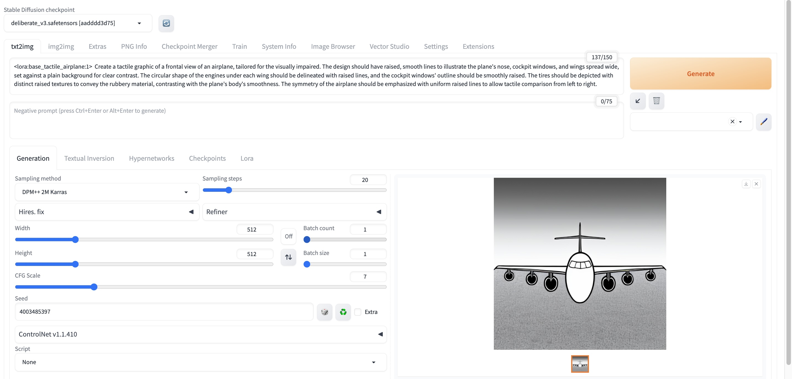

# TactileNet: Advancing Accessibility with Stable Diffusion-Driven Tactile Graphics

## Introduction

In the era of digital accessibility, catering to the needs of visually impaired individuals remains a paramount challenge. With over 2.2 billion people globally suffering from some form of vision impairment, innovative solutions are imperative. Our work presents a novel approach leveraging deep learning models, notably Stable Diffusion (SD) models, to automate the creation of tactile graphics—a critical tool for visual accessibility.

Our methodology involves fine-tuning SD models using advanced techniques such as Low-Rank Adaptation (LoRA) and DreamBooth, with the help of our developed dataset TactileNet, a specialized dataset tailored for training vision-language models. Through rigorous experimentation and evaluation, we demonstrate the efficacy of our adapted SD models in generating tactile graphics possibly suitable for visually impaired users. Our results showcase our fine-tuned model’s ability to produce intricate tactile features essential for tactile recognition.

Despite challenges, including limited data availability and model complexity, our findings underscore the potential of automated solutions to benefit the tactile graphics production. As we set a starting point for future endeavors to gather more comprehensive data and refine artificial intelligence generative technology for tactile creation, collaborative efforts with accessibility experts and end-users will be pivotal in enhancing the accessibility and usability of generated tactile outputs.

## Setup Instructions

Follow the steps below to use our fine-tuned adapters in Stable Diffusion WebUI.

### Step 1: Set Up Stable Diffusion WebUI

1. **Install Stable Diffusion WebUI**: Follow the steps [here](https://github.com/AUTOMATIC1111/stable-diffusion-webui) to install and set up the interface on your system.

### Step 2: Clone Repository and Copy Adapters

1. **Clone Repository**:
   ```bash
   git clone https://github.com/Adnan-Khan7/TactileNet.git
   cd TactileNet
2. Copy Adapters: Copy all 15 adapters from TactileNet/models/ folder to /stable-diffusion-webui/models/Lora.

### Step 3: Download and Place Generator Models
Generator Model 1: Download the stable-diffusion-v1-5 model (v1-5-pruned-emaonly.safetensors) checkpoint from [Hugging Face](https://huggingface.co/runwayml/stable-diffusion-v1-5/tree/main ) and place it in the folder /stable-diffusion-webui/models/Stable-diffusion.

Generator Model 2: Download the deliberate_v3.safetensors model from [Google Drive](https://drive.google.com/file/d/1bQo3oElYmsCmrcT-EgGeriBGszZmzUgW/view?usp=sharing) and place it in the folder /stable-diffusion-webui/models/Stable-diffusion.

## Usage
Once the setup is complete, you can start generating tactile graphics using the Stable Diffusion WebUI with our fine-tuned adapters. Follow the WebUI instructions to load the models and adapters, and generate images based on your prompts. An example usage of lora adapter for "airplane" class is shown in Figure below. 


## Configurations
Keep the default hyper-parameters for text to image translation. For image to image translation denoising strength between 0.8 - 0.85 for most classes bear good results.

## License
This project is licensed under the MIT License.
