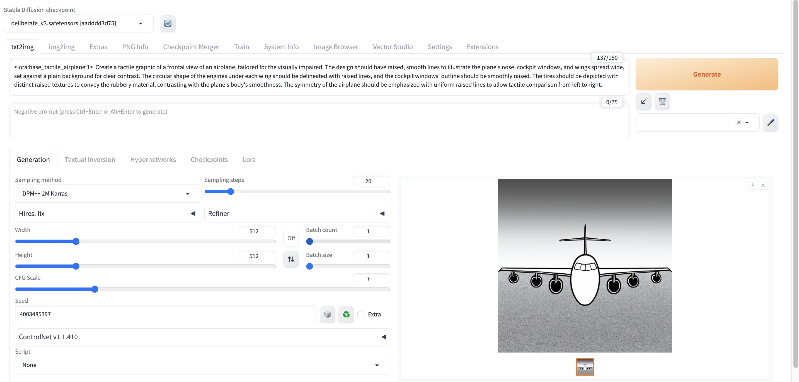

# TactileNet: Bridging the Accessibility Gap with AI-Generated Tactile Graphics for Individuals with Vision Impairment

Official repository for project: [TactileNet](https://tactilenet.github.io/)  
Authors: Adnan Khan, Alireza Choubineh, Mai A. Shaaban, Abbas Akkasi, Majid Komeili

[](https://tactilenet.github.io/)
[](LICENSE)

---

## 🔍 Abstract

Tactile graphics are essential for providing access to visual information for the 43 million people globally living with vision loss. Traditional methods for creating these graphics are labor-intensive and cannot meet growing demand. We introduce TactileNet, the first comprehensive dataset and AI-driven framework for generating embossing-ready 2D tactile templates using text-to-image Stable Diffusion models. We fine-tune Stable Diffusion models using Low-Rank Adaptation and DreamBooth to generate high-fidelity, guideline-compliant graphics with reduced computational cost. Quantitative evaluations with tactile experts show 92.86\% adherence to accessibility standards. Our structural fidelity analysis revealed near-human design similarity, with a Structural Similarity Index (SSIM) of 0.538 between generated and expert-designed tactile images. Notably, our method better preserves object silhouettes than human designs (binary mask SSIM: 0.259 vs. 0.215), addressing a key limitation of manual abstraction. The framework scales to 32,000 images (7,050 high-quality) across 66 classes, with prompt editing enabling customizable outputs (e.g., adding or removing details). By automating the 2D template generation step—compatible with standard embossing workflows—TactileNet accelerates production while preserving design flexibility. This work demonstrates how AI can augment (not replace) human expertise to bridge the accessibility gap in education and beyond. 

**TL;DR:** TactileNet uses small, domain-tuned LoRA + DreamBooth adapters to generate high-fidelity tactile graphics for visually impaired users using Stable Diffusion.


---


## 🧠 Method Overview

TactileNet uses class-specific LoRA and DreamBooth adapters fine-tuned on 66 categories of tactile graphics. Each adapter is trained on a small number of high-quality, expert-sourced images and their structured prompts. The model supports both text-to-image and image-to-image generation via Stable Diffusion v1.5.

Key Features:
- High SSIM similarity (0.538 vs expert designs)
- Better silhouette preservation (0.259 vs 0.215 in binary SSIM)
- Fully compatible with embossing workflows
- Supports prompt-level editing (e.g., add/remove logo, features)

---

## ⚙️ Setup Instructions

### 1. Set Up Stable Diffusion WebUI

Follow instructions from the [Stable Diffusion WebUI](https://github.com/AUTOMATIC1111/stable-diffusion-webui) repository.

### 2. Clone Repository

```bash
git clone https://github.com/Adnan-Khan7/TactileNet.git
cd TactileNet
```

### 3. Copy Adapters

Download LoRA adapters from [Google Drive](https://drive.google.com/drive/folders/1XFn4wlcTogWbXtm4lc0cnyEN0vH7mBVy?usp=sharing)


Copy all the .safetensors files to:

```
stable-diffusion-webui/models/Lora/
```

### 4. Download Base Models

- **SD v1.5**: Get `v1-5-pruned-emaonly.safetensors` from [Hugging Face](https://huggingface.co/runwayml/stable-diffusion-v1-5).
- **Deliberate v3** (optional): [Download](https://drive.google.com/file/d/10I-zz34ImDOnh8KmvWdlGdxz1I8oqB1o/view?usp=sharing)

Place in: `/stable-diffusion-webui/models/Stable-diffusion/`

---

## 🧪 Usage & Configuration

- Use the WebUI to generate tactile graphics with prompts like:
  > "Create a tactile graphic of an airplane for visually impaired users, emphasizing raised wings, fuselage, and tail."
- For **image-to-image** translation: Use denoising strength between `0.85–0.9`
- For **text-to-image** generation: Default settings (CFG=7, steps=20) suffice
- Example configuration shown below:



---

## 📈 Evaluation Protocol

- **132 tactile graphics evaluated** (66 generated + 66 benchmark)
- **66 natural images** as reference
- Evaluation Metrics:
  - Pose accuracy (Q1)
  - Guideline adherence (Q2)
  - Expert-rated quality (Q3)
  - SSIM (structural fidelity)

---

## 📦 Reproducibility

Includes:
- `ssim.py` for evaluating image similarity
- Prompt examples
- Precomputed metrics (coming soon)

---

## 📄 License

This project is licensed under the MIT License.

---

## 🙏 Acknowledgments

This work was supported in part by MITACS and the Digital Alliance of Canada. We thank the student volunteers at the Intelligent Machines Lab, Carleton University, for their help with dataset curation and image matching.
